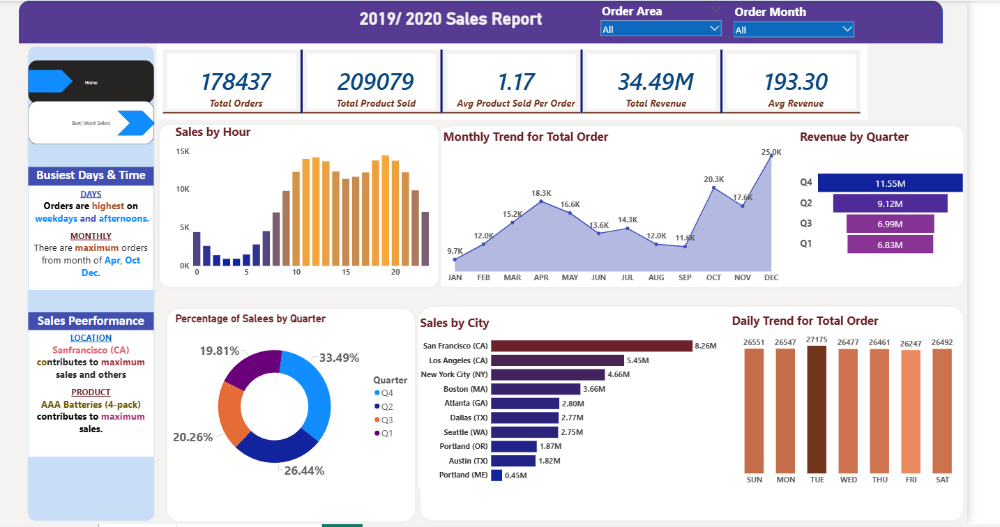
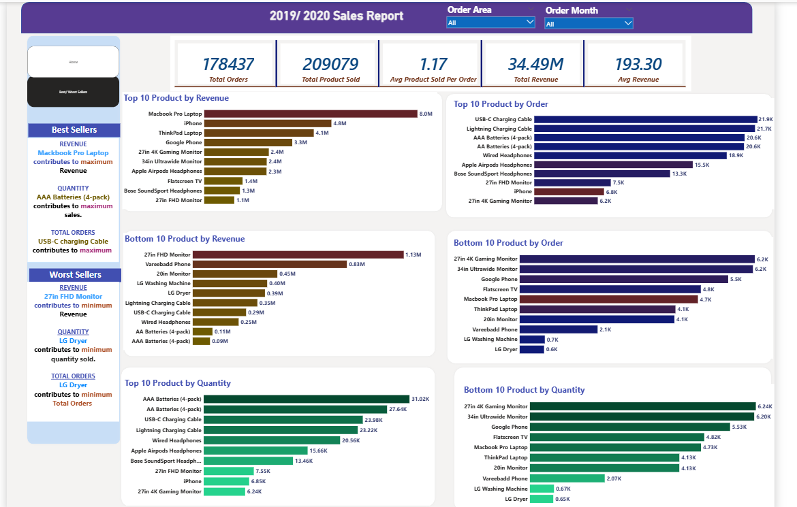

# 🛒 2019/2020 Sales Report

A Power BI business intelligence project analysing electronics retail sales across 10 U.S. cities, covering revenue trends, product performance, order volume, and time-of-day demand patterns for the 2019/2020 period.

---

## 📁 Repository structure

```
sales-analysis/
│
├── README.md
│
├── documentation/
│   ├── 01_Project_Overview.md
│   ├── 02_Business_Requirements.md
│   ├── 03_Data_Preparation.md
│   ├── 04_Data_Model.md
│   ├── 05_DAX_Measures.md
│   ├── 06_Dashboard_Explanation.md
│   ├── 07_Business_Insights.md
│   └── 08_Recommendations.md
│
├── powerbi/
│   └── Sales_Analysis.pbix
│
├── screenshots/
│   ├── dashboard_page_1.png
│   └── dashboard_page_2.png
│
└── data/
```

---

## 📊 Dashboard preview

### Page 1 — Home (Sales Overview)


### Page 2 — Best / Worst Sellers


---

## 🔑 Key metrics

| Metric | Value |
|--------|-------|
| Total orders | 178,437 |
| Total product sold | 209,079 |
| Avg product sold per order | 1.17 |
| Total revenue | $34.49M |
| Avg revenue per order | $193.30 |
| Cities covered | 10 |
| Top product by revenue | Macbook Pro Laptop ($8.0M) |
| Top product by quantity | AAA Batteries 4-pack (31.02K units) |
| Top product by orders | USB-C Charging Cable (21.9K orders) |
| Top city by revenue | San Francisco, CA ($8.26M) |
| Strongest quarter | Q4 ($11.55M — 33.49% of total) |

---

## 📈 Highlights

- **Q4 dominates** — 33.49% of annual revenue, driven by strong April, October, and December order volumes
- **December is the peak month** with ~25K orders, more than 2.5× January's ~9.7K
- **San Francisco leads all cities** at $8.26M — nearly double Los Angeles ($5.45M) and over 18× Portland ME ($0.45M)
- **Two-speed product mix** — Macbook Pro Laptop drives $8M from only 4.73K units ($1,700/unit), while AAA Batteries drive 31K units at $0.09M total ($3/unit)
- **Orders peak twice daily** — late morning (10 AM–1 PM) and early evening (6–8 PM)
- **Day-of-week demand is flat** — Tuesday is busiest but the spread across all seven days is under 4%
- **Most orders contain a single product** — avg 1.17 products per order, confirming a strong cross-sell opportunity

---

## 🗂️ Dashboard pages

### Page 1 — Home
Covers overall sales performance across time and geography:
- KPI cards: Total Orders, Total Product Sold, Avg Product Sold Per Order, Total Revenue, Avg Revenue
- Narrative callouts: Busiest Days & Time, Sales Performance
- Sales by Hour
- Monthly Trend for Total Order
- Revenue by Quarter
- Percentage of Sales by Quarter (donut chart)
- Sales by City
- Daily Trend for Total Order

### Page 2 — Best / Worst Sellers
Covers product-level performance ranking:
- Narrative callouts: Best Sellers (revenue / quantity / orders), Worst Sellers (revenue / quantity / orders)
- Top 10 / Bottom 10 Product by Revenue
- Top 10 / Bottom 10 Product by Order
- Top 10 / Bottom 10 Product by Quantity

---

## 🛠️ Tools used

| Tool | Purpose |
|------|---------|
| Power BI Desktop | Data modelling and dashboard |
| DAX | 9 calculated measures |
| Power Query (M) | Data ingestion and transformation |
| GitHub | Version control and documentation |

---

## 📄 Documentation

Full documentation is in the [`documentation/`](documentation/) folder:

| File | Contents |
|------|----------|
| [01 Project Overview](documentation/01_Project_Overview.md) | Background, objectives, scope, key numbers |
| [02 Business Requirements](documentation/02_Business_Requirements.md) | Stakeholder questions, KPIs, filtering requirements |
| [03 Data Preparation](documentation/03_Data_Preparation.md) | Source tables, Power Query transformations, data quality notes |
| [04 Data Model](documentation/04_Data_Model.md) | Schema, table structures, relationships |
| [05 DAX Measures](documentation/05_DAX_Measures.md) | All 9 measures with DAX code, values, and fix history |
| [06 Dashboard Explanation](documentation/06_Dashboard_Explanation.md) | Page-by-page visual walkthrough with real values |
| [07 Business Insights](documentation/07_Business_Insights.md) | Data-backed findings across revenue, product, geography, and time |
| [08 Recommendations](documentation/08_Recommendations.md) | Prioritised business recommendations with supporting data |

